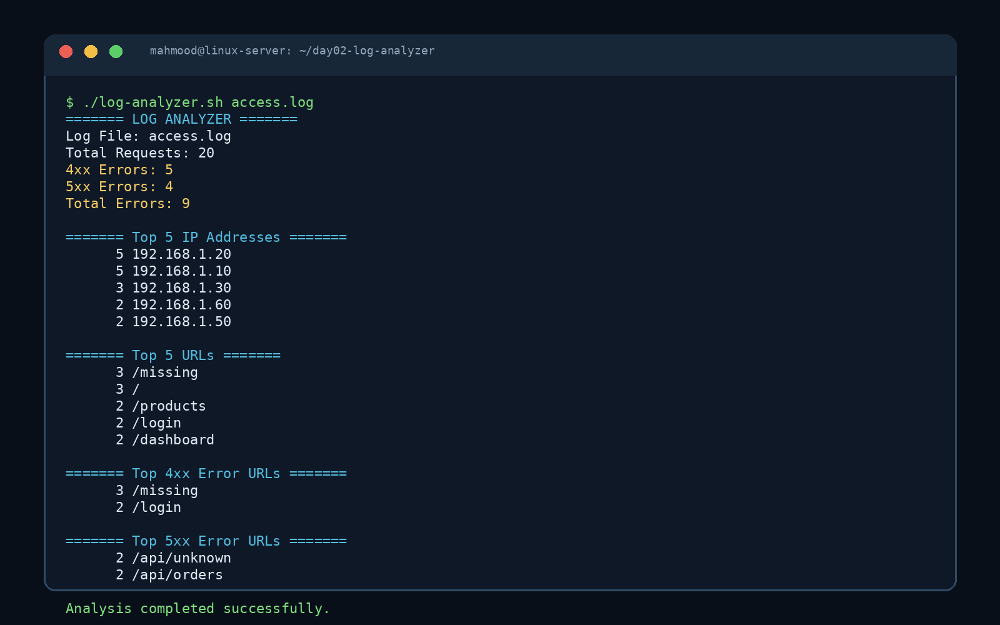

# Day 2 — Log Analyzer

مشروع DevOps رقم **2/30** باستخدام Linux وBash. يقوم السكربت بتحليل access logs بصيغة Apache/Nginx الشائعة، ثم يحول السجلات الخام إلى إحصاءات مفيدة للمراقبة واستكشاف الأخطاء.

## فكرة المشروع

تتعامل خوادم الويب مع عدد كبير من الطلبات، وتُسجل كل عملية في ملف access log. بدل قراءة الملف يدويًا، يستخدم هذا المشروع أدوات Linux مثل `awk` و`sort` و`uniq` و`wc` لاستخراج أكثر عناوين IP استخدامًا، وأكثر الروابط طلبًا، وروابط أخطاء HTTP من نوع 4xx و5xx.

> الهدف التعليمي هو بناء أداة CLI صغيرة وموثوقة، مع دعم التحقق من الملف، الوسائط، رسائل المساعدة، وExit Codes واضحة.

## Project Structure

```text
day02-log-analyzer/
├── access.log
├── log-analyzer.sh
├── README.md
└── screenshot.png
```

## Features

يعرض السكربت إجمالي عدد الطلبات، وعدد أخطاء 4xx و5xx، وإجمالي الأخطاء، وأعلى خمسة عناوين IP، وأعلى خمسة URLs، وأعلى URLs التي سببت أخطاء 4xx و5xx. كما يتحقق من وجود الملف وقابليته للقراءة وعدم فراغه، ويدعم تمرير مسار ملف مخصص وخيار `--help`.

## المتطلبات

يحتاج المشروع إلى Linux أو WSL وBash والأوامر القياسية التالية:

| الأمر | دوره في المشروع |
|---|---|
| `awk` | قراءة الحقول، فلترة status codes، وإجراء الحسابات |
| `grep` | البحث عن أنماط نصية في الاستخدامات اليدوية |
| `sort` | ترتيب النتائج |
| `uniq -c` | عدّ القيم المتكررة |
| `wc` | حساب عدد السطور |
| `head` | عرض أعلى النتائج فقط |
| `cat` | عرض المساعدة متعددة الأسطر |
| `chmod` | جعل السكربت قابلًا للتنفيذ |
| `git` | حفظ المشروع ورفعه إلى GitHub |

## طريقة التشغيل

انتقل إلى مجلد المشروع:

```bash
cd day02-log-analyzer
```

اجعل السكربت قابلًا للتنفيذ:

```bash
chmod +x log-analyzer.sh
```

شغّل السكربت باستخدام الملف الافتراضي:

```bash
./log-analyzer.sh
```

أو مرر ملفًا محددًا:

```bash
./log-analyzer.sh access.log
```

اعرض المساعدة:

```bash
./log-analyzer.sh --help
```

تحقق من بناء Bash دون تنفيذ السكربت:

```bash
bash -n log-analyzer.sh
```

احفظ التقرير في ملف مع إبقائه ظاهرًا على الشاشة:

```bash
./log-analyzer.sh access.log | tee report.txt
```

## صيغة access.log

يستخدم المشروع صيغة Apache/Nginx Combined Log Format. مثال السطر التالي:

```text
192.168.1.10 - - [17/Aug/2026:09:00:01 +0300] "GET /api/users HTTP/1.1" 200 923
```

يمكن تمثيل الحقول الرئيسية كالتالي:

| الحقل | القيمة في المثال | معنى الحقل |
|---|---|---|
| `$1` | `192.168.1.10` | عنوان IP |
| `$7` | `/api/users` | المسار المطلوب |
| `$9` | `200` | HTTP status code |
| `$10` | `923` | حجم الاستجابة |

في هذا المشروع نهتم خصوصًا بـ `$1` و`$7` و`$9`.

## شرح السكربت

### Shebang وPipefail

```bash
#!/usr/bin/env bash
set -o pipefail
```

يحدد `#!/usr/bin/env bash` أن السكربت يعمل باستخدام Bash. أما `set -o pipefail` فيجعل الـpipeline يفشل إذا فشل أحد الأوامر داخله، بدل الاعتماد على نتيجة آخر أمر فقط.

### المتغيرات وCommand-Line Arguments

```bash
SCRIPT_NAME="$0"
LOG_FILE="${1:-access.log}"
```

يمثل `$0` اسم السكربت كما استُدعي من الطرفية، ويمثل `$1` أول argument يمرره المستخدم. التعبير `${1:-access.log}` يعني استخدام أول argument إذا كان موجودًا، واستخدام `access.log` تلقائيًا إذا لم يمرر المستخدم أي ملف.

مثال:

```bash
./log-analyzer.sh custom.log
```

في هذه الحالة تكون قيمة `$0` هي `./log-analyzer.sh` وقيمة `$1` هي `custom.log`.

### دالة المساعدة وHere Document

```bash
show_help() {
    cat <<EOF
Usage: $SCRIPT_NAME [LOG_FILE]
...
EOF
}
```

الدالة تجمع منطق عرض التعليمات في مكان واحد. الصيغة `cat <<EOF` تسمى **Here Document**، وتسمح بكتابة نص متعدد الأسطر وإرساله إلى `cat`.

### التحقق من الوسائط

```bash
if [[ "${1:-}" == "--help" || "${1:-}" == "-h" ]]; then
    show_help
    exit 0
fi
```

يتحقق الشرط من طلب المساعدة. الرمز `||` يعني OR. عند عرض المساعدة ينهي السكربت عمله بـ `exit 0`، وهي إشارة نجاح.

```bash
if [[ "$#" -gt 1 ]]; then
    echo "Error: too many arguments." >&2
    show_help >&2
    exit 2
fi
```

يمثل `$#` عدد arguments. يسمح السكربت بملف واحد فقط. الرمز `>&2` يرسل رسالة الخطأ إلى standard error بدل standard output، و`exit 2` يستخدم لخطأ في طريقة استخدام الأمر.

### التحقق من الملف

```bash
if [[ ! -f "$LOG_FILE" ]]; then
    echo "Error: Log file '$LOG_FILE' not found." >&2
    exit 1
fi
```

الاختبار `-f` يتحقق من أن المسار ملف عادي، و`!` يعكس النتيجة. لذلك يعرض السكربت خطأ إذا لم يكن الملف موجودًا.

```bash
if [[ ! -r "$LOG_FILE" ]]; then
    exit 1
fi

if [[ ! -s "$LOG_FILE" ]]; then
    exit 1
fi
```

يتحقق `-r` من قابلية القراءة، بينما يتحقق `-s` من أن الملف غير فارغ.

### التحقق باستخدام awk

```bash
awk 'NF >= 9 && $9 ~ /^[0-9][0-9][0-9]$/ { found=1; exit } END { exit(found ? 0 : 1) }' "$LOG_FILE"
```

يمثل `NF` عدد الحقول في السطر. يتأكد التعبير من وجود تسعة حقول على الأقل، ومن أن الحقل التاسع مكون من ثلاثة أرقام، وهو الشكل المعتاد لـ HTTP status code. إذا لم يجد أي سطر مناسب، يخرج السكربت بـ `exit 1`.

## أوامر التحليل التي تعلمتها

### wc

```bash
wc -l access.log
```

الخيار `-l` يحسب عدد السطور. في المشروع نستخدم:

```bash
TOTAL_REQUESTS=$(wc -l < "$LOG_FILE")
```

يتم استخدام `<` لإرسال الملف إلى `wc` دون طباعة اسم الملف، ولذلك نحصل على الرقم فقط.

### awk و`$0` و`$1` و`$7` و`$9`

```bash
awk '{print $1}' access.log
```

يطبع `$1`، أي أول حقل، وهو عنوان IP.

```bash
awk '{print $7}' access.log
```

يطبع المسار المطلوب URL.

```bash
awk '{print $9}' access.log
```

يطبع HTTP status code.

في `awk`، يتم تقسيم السطر افتراضيًا حسب whitespace. أما `$0` فيمثل السطر كاملًا، و`$1` يمثل أول field، وهكذا.

### awk مع شروط status codes

```bash
awk '$9 ~ /^4[0-9][0-9]$/ {print $7}' access.log
```

العامل `~` يعني مطابقة Regular Expression. النمط `^4[0-9][0-9]$` يطابق أي status code يبدأ بالرقم 4 ويتكون من ثلاثة أرقام، مثل 400 و401 و404.

لأخطاء 5xx:

```bash
awk '$9 ~ /^5[0-9][0-9]$/ {print $7}' access.log
```

### حساب الأخطاء

```bash
ERROR_4XX=$(awk '$9 ~ /^4[0-9][0-9]$/ { count++ } END { print count + 0 }' "$LOG_FILE")
ERROR_5XX=$(awk '$9 ~ /^5[0-9][0-9]$/ { count++ } END { print count + 0 }' "$LOG_FILE")
TOTAL_ERRORS=$((ERROR_4XX + ERROR_5XX))
```

يزيد `count++` العداد لكل سطر يطابق الشرط. كلمة `END` تنفذ الأمر بعد قراءة الملف. أما `$((...))` فهي Arithmetic Expansion في Bash وتستخدم لجمع القيم الرقمية.

### sort

```bash
sort
```

يرتب النص أبجديًا. ولترتيب الأرقام تنازليًا نستخدم:

```bash
sort -nr
```

الخيار `-n` يطلب ترتيبًا رقميًا، والخيار `-r` يعكس الترتيب ليصبح من الأكبر إلى الأصغر.

### uniq -c

```bash
uniq -c
```

يحسب تكرار السطور المتجاورة. لذلك نستخدمه بعد `sort` حتى تصبح القيم المتطابقة بجانب بعضها:

```bash
sort | uniq -c
```

### head

```bash
head -n 5
```

يعرض أول خمسة أسطر فقط. في المشروع نستخدمه لإظهار Top 5.

### Pipeline كامل

```bash
awk '{print $1}' access.log | sort | uniq -c | sort -nr | head -n 5
```

تدفق البيانات يكون كالتالي:

```text
access.log → awk → sort → uniq -c → sort -nr → head -n 5
```

يستخرج الأمر عناوين IP، ثم يعدّ تكرارها، ويرتبها من الأكثر إلى الأقل، ويعرض أعلى خمسة.

## Exit Codes

| Exit Code | المعنى |
|---:|---|
| `0` | اكتمل التحليل بنجاح أو عُرضت المساعدة |
| `1` | الملف غير موجود أو غير قابل للقراءة أو غير صالح |
| `2` | تم تمرير arguments غير صحيحة |

لفحص آخر Exit Code:

```bash
./log-analyzer.sh access.log
echo $?
```

يمثل `$?` نتيجة آخر أمر تم تنفيذه.

## أمثلة الاستخدام

```bash
./log-analyzer.sh
./log-analyzer.sh access.log
./log-analyzer.sh --help
./log-analyzer.sh nginx.log
echo $?
```

إذا لم يكن `nginx.log` موجودًا، ستكون النتيجة:

```text
Error: Log file 'nginx.log' not found.
1
```

## Sample Output

```text
======= LOG ANALYZER =======
Log File: access.log
Total Requests: 20
4xx Errors: 5
5xx Errors: 4
Total Errors: 9

======= Top 5 IP Addresses =======
      5 192.168.1.10
      5 192.168.1.20
      3 192.168.1.30
      2 192.168.1.40
      2 192.168.1.50

======= Top 5 URLs =======
      3 /
      3 /missing
      2 /api/orders
      2 /api/unknown
      2 /api/users

======= Top 4xx Error URLs =======
      3 /missing
      2 /login

======= Top 5xx Error URLs =======
      2 /api/orders
      2 /api/unknown

Analysis completed successfully.
```

القيم الفعلية تظهر عند تشغيل السكربت، وقد يكون ترتيب العناصر المتساوية مختلفًا حسب نسخة `sort` والبيئة.

## Screenshot

توضح الصورة المرفقة تشغيل محلل السجلات وظهور الإحصاءات في الطرفية:


